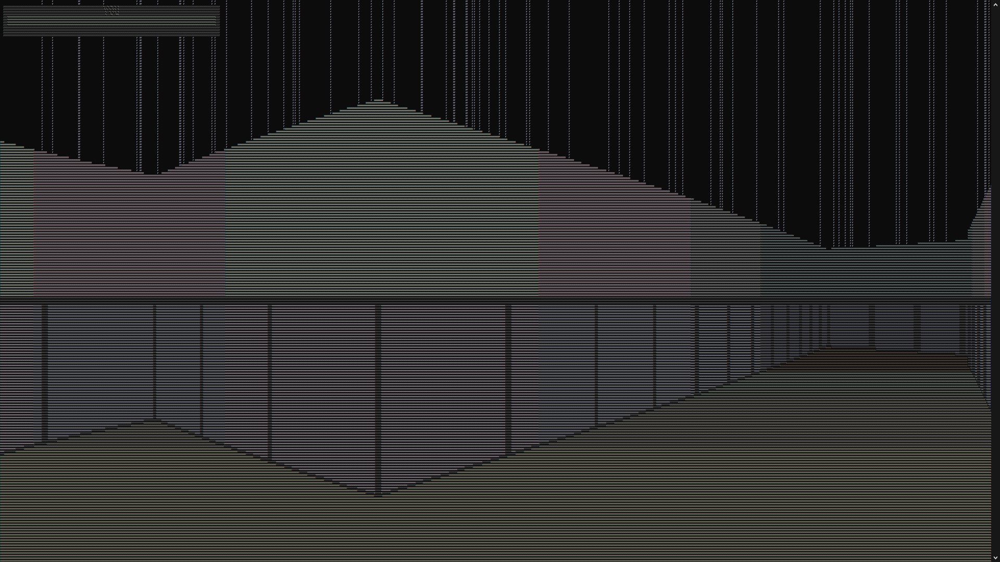
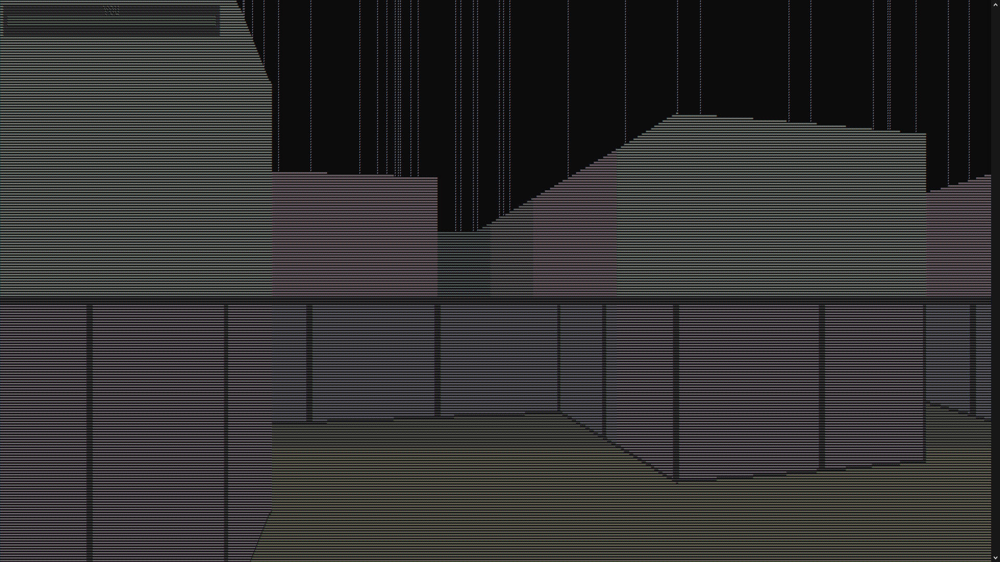
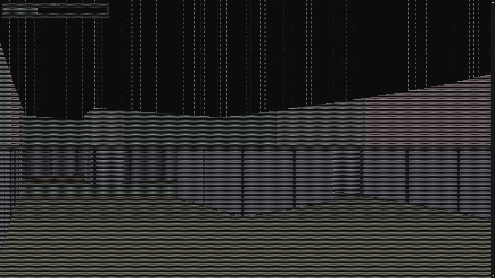
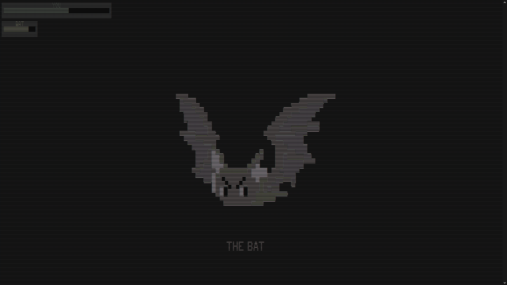
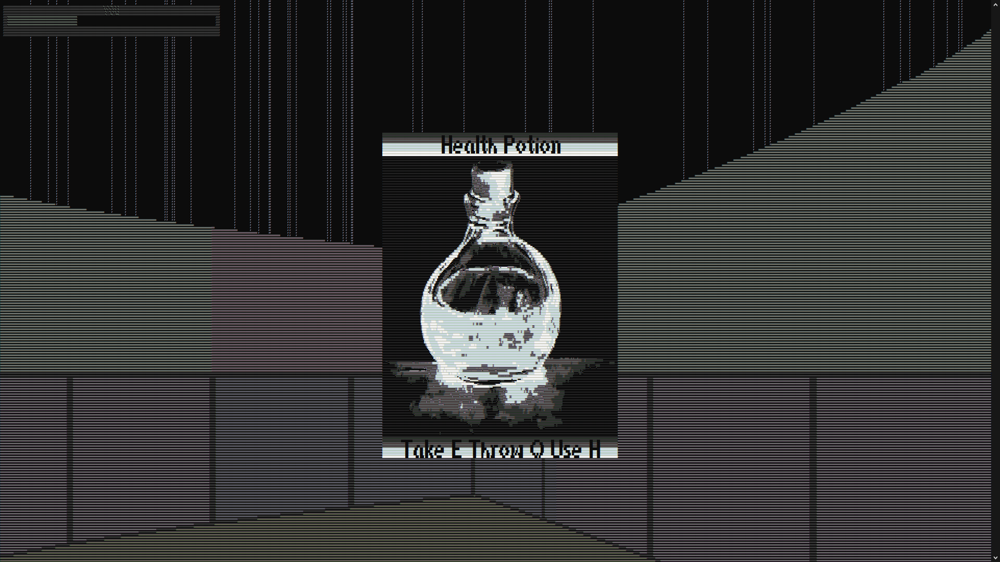
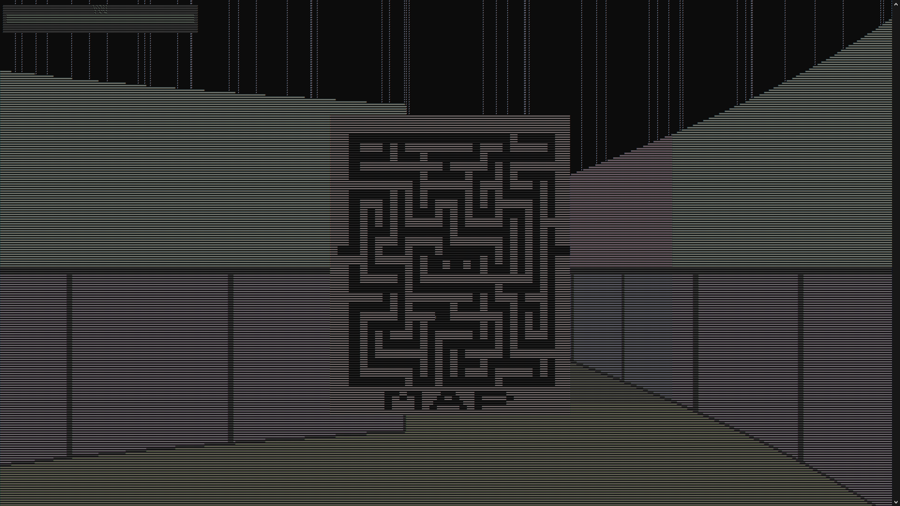

# Лабиринт Дракулы

Лабиринт Дракулы - это игра, в которой вы попадаете в лабиринт, заполненный опасностями в том числе и самим Дракулой. Вам предстоит победить Дракулу и найти зелье лечения, чтобы выжить и победить.

## Особенности игры

- Лабиринт: Игра происходит в загадочном лабиринте, где каждый ход может быть опасным. Вам нужно будет исследовать лабиринт и находить короткие пути.
- Противники: В игре присутствует босс, с которым вам придется сражаться. Враг имеет свои собственные характеристики и атаки. Будьте осторожны и используйте свои навыки, чтобы победить его.
- Зелье лечения: В лабиринте вы сможете найти зелье лечения, которое поможет восстановить ваше здоровье. Будьте внимательны и ищите зелье, чтобы выжить в сражении.
- Интерфейс: В игре есть пользовательский интерфейс, который показывает ваше текущее здоровье и здоровье противника. Вы можете отслеживать свой прогресс и принимать решения на основе своего состояния.

## Установка

- Создайте проект проект в Visual Studio.
- Перенесите файлы из папки C: на диск С.
- Перенесите папку CARDS в папку с проектом.
- Чтобы запустить игру, запустите проект. После запуска игры первым, что вы увидите, будет появление окна «Меню» с названием игры. Чтобы закрыть это окно, вы можете нажать на стрелку вверх (кнопку «↑»).

## Управление

- Поворот: Вы можете поворачивать персонажа с помощью мыши или стрелочных клавиш.
- Движение: Используйте клавиши WASD для перемещения по лабиринту.
- Зелье лечения: Если у вас есть зелье лечения в инвентаре, вы можете использовать его, нажав клавишу 'H'.
- Рестарт: Если вам нужно начать уровень заново, вы можете нажать клавишу 'R'.
- Выход: Если вы хотите выйти из игры, просто нажмите клавишу Esc.
- Бег: Если вы хотите ускориться, нажмите Shift.
- Атака: Для атаки просто нажимайте F.
- Карта: Если вы заблудились нажмите TAB.

## Бой

- Сражение: Вас ожидают сражение с самим Дракулой. Вы сможете атаковать его, нажимая клавишу 'F', его здоровье будет отображаться на панели здоровья.
- Зелье лечения: Если ваше здоровье опускается, вы можете использовать зелье лечения, чтобы восстановить некоторое количество здоровья, нажав 'H'.

