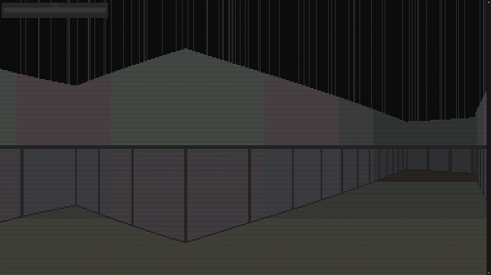
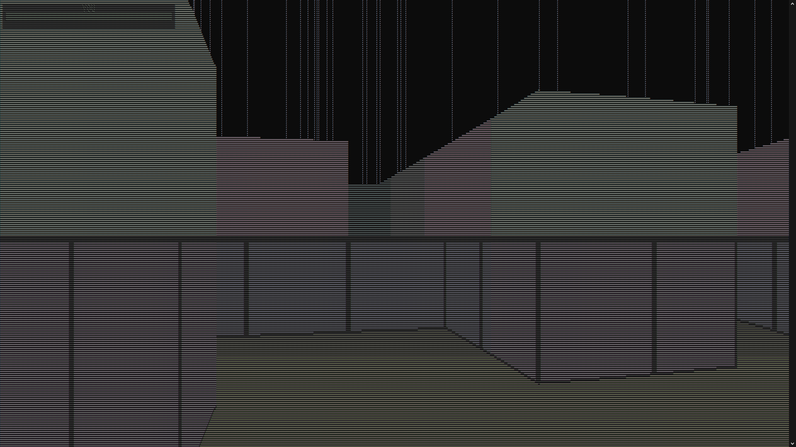
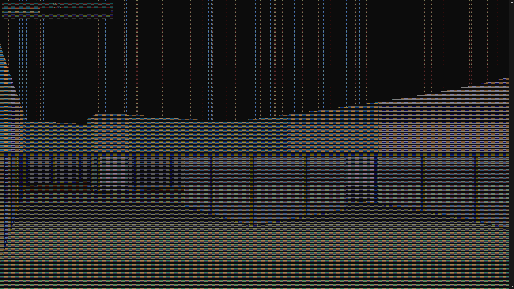
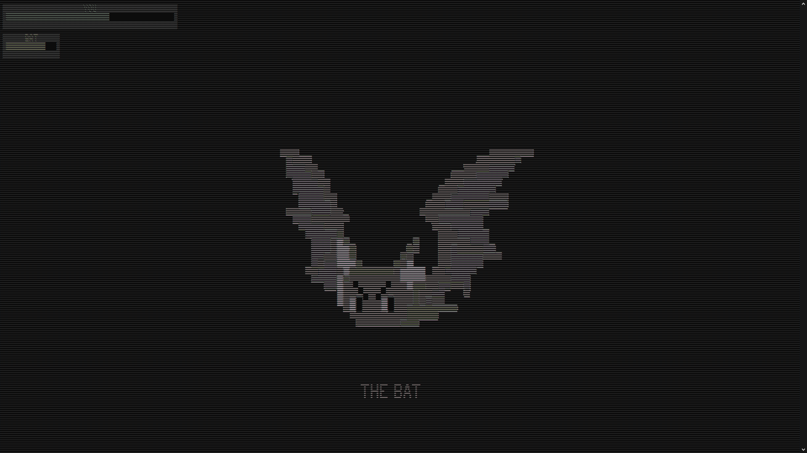
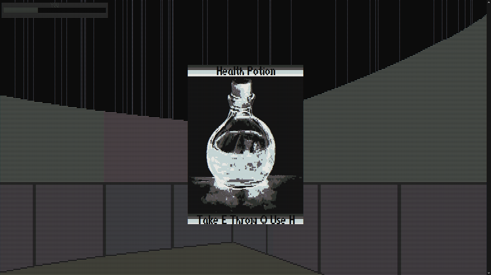
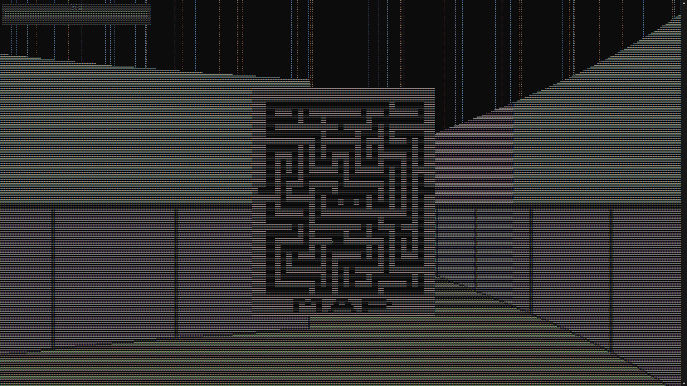

# Dracula's Labyrinth

Dracula's Labyrinth is a game in which you enter a maze filled with dangers including Dracula himself. You will have to defeat Dracula and find a healing potion to survive and win.

## Game Features

- Labyrinth: The game takes place in a mysterious maze where every move can be dangerous. You will need to explore the maze and find shortcuts.
- Opponents: The game features a boss that you will have to fight. The enemy has its own characteristics and attacks. Be careful and use your skills to defeat him.
- Healing Potion: In the maze you will be able to find a healing potion that will help you restore your health. Be careful and look for the potion to survive the battle.
- Interface: The game has a user interface that shows your current health and the enemy's health. You can track your progress and make decisions based on your health.

## Installation

- Create a project in Visual Studio.
- Move the files from the C: folder to the C drive.
- Move the CARDS folder to the project folder.
- To run properly, set the character size on the command line to 5 
and you may need to use a monitor with a resolution of 1920x1080
- To run the game, start the project. After starting the game, the first thing you will see is a ‘Menu’ window with the name of the game. To close this window, you can click on the up arrow (the ‘↑’ button).

## Controls

- Rotate: You can rotate the character using the mouse or the arrow keys.
- Movement: Use the WASD keys to move around the maze.
- Healing Potion: If you have a healing potion in your inventory, you can use it by pressing the ‘H’ key.
- Restart: If you need to start the level again, you can press the ‘R’ key.
- Exit: If you want to quit the game, just press the Esc key.
- Running: If you want to speed up, press Shift.
- Attack: To attack, simply press F.
- Map: If you get lost, press TAB.

## Combat

- Combat: You will be facing Dracula himself. You will be able to attack him by pressing the ‘F’ key, his health will be displayed on the health bar.
- Healing Potion: If your health drops, you can use a healing potion to restore some health by pressing ‘H’.

## Authors and licenses

In my work, I was guided and used the code from the repository located at:
https://github.com/OneLoneCoder/CommandLineFPS/blob/master/CommandLineFPS.cpp

And also on the video at: 
https://youtu.be/xW8skO7MFYw

## Screenshots
Images may appear different on various monitors because the color palette is displayed differently, depending on how the human eye perceives the symbols and colors presented by each screen.

